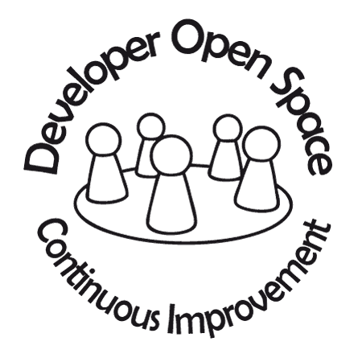

# DevOpenSpace2016

Web: https://devopenspace.de/  
Twitter: http://twitter.com/devopenspace

Datum: 14.Oktober 2016

#Workshop: Microservices mit .NET und RabbitMQ  
mit Frank Pommerening 

## Inhalt
1. [Zielgruppe](#zielgruppe)
2. [Inhalt](#inhalt)
3. [Teilnehmer-Voraussetzung / Vorbereitung](#voraussetzungen)

## 1. Zielgruppe
Dieser Workshop richtet sich an Entwickler, die mehr über RabbitMQ als ein Weg zu zuverlässige und skalierbare verteilte .Net Anwendungen erfahren möchten.

 
## 2. Inhalt
Die Teilnehmer erhalten Informationen über die Grundlagen von RabbitMQ und dessen Bereitstellung auch in hochverfügbaren Umgebung. Darüber hinaus jedoch setzt der Workshop einen 
deutlichen Akzent auf die Nutzung von RabbitMQ in .Net-Microservices. Viele praktische Beispiele und gemeinsame Übungen sollen den Teilnehmern die Vor- 
und auch Nachteile gegenüber reinen HTTP-basierten Implementierungen zeigen.

Die folgende Liste gibt einen Überblick über mögliche Themen.
- RabbitMQ
   - Grundlagen
   - Bereitstellung unter Windows und im Containerumfeld
   - Einrichtung RabbitMQ-Cluster
- Einstieg in EasyNetQ
   - Warum nicht nativ?
   - Zugriffstechniken, z.B. Publish - Subscribe
   - Erweiterung
   - Fehlerbehandlung
- Beispiele
   - Grundlagen EasyNetQ
   - zentrales Logging für Webanwendungen
   - Image-Workflow

Hinweis: In diesem Workshop wird Docker für die Bereitstellung der Infrastuktur z.b. Datenbank oder Nodes für RabbitMQ-Cluster verwendet. Kenntnisse in Docker sind von Vorteil aber keine Voraussetzung.
Der Fokus liegt des Workshops liegt auf der Implementierung der .Net-Microservices.

3. Teilnehmer-Voraussetzungen / Vorbereitung
[x] Notebook mit 2015 mit Update 3 (z.B. <a href="https://www.visualstudio.com/de-de/downloads/download-visual-studio-vs.aspx">Community Edition</a>) 
[x] <a href="https://www.microsoft.com/net/core">.NET Core mit VS 2015 Tooling</a> 
[x] Dockerumgebung z.B. <a href="https://www.docker.com/products/docker-toolbox">Docker-Toolbox</a> oder <a href="https://docs.docker.com/docker-for-windows/"> Docker for Windows</a>

Um die korrekte Funktion der Dockerumgebung zu testen startet bitte die <a href="startupApp.md" > StartUp-App </a>.

<b>Die Präsentation könnt ihr auf der <a href="http://fpommerening.github.io/DevOpenSpace2016/index.html">GitHub-Page</a> einsehen.</b>
Hinweis: die finale Version wir erst nach dem Workshop bereitgestellt.